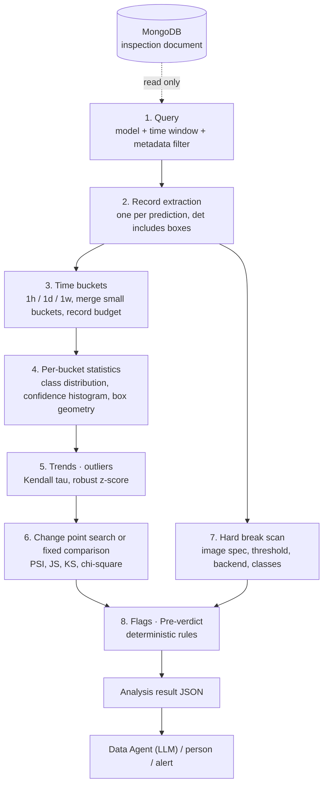
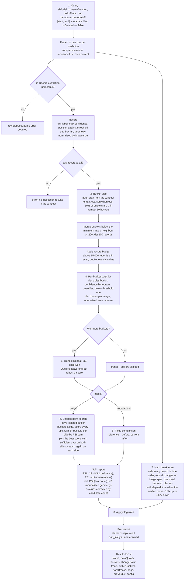

# [Data Service] Data Drift Analysis — How It Works

**Korean version:** [data_drift.ko.md](data_drift.ko.md)

---

## 1. Purpose

- Compute the statistics needed to decide whether a deployed inspection model's input data or behaviour changed.
  - Typical causes: a camera moves, lighting changes, a new supplier's parts arrive, a lens gets dirty.
  - The model keeps answering, but there is no ground truth at inference time, so nobody notices.
- The database holds no images and no true labels.
  - It does hold everything the model output: predicted class, confidence, bounding boxes, the applied threshold.
  - The tool therefore watches the distribution of model outputs over time.
- The tool never decides on its own.
  - It produces deterministic flags and a pre-verdict.
  - An LLM or a person reads the numbers and confirms or overrules them.
- It is one of the MongoDB MCP tools called by the Data Agent.
  - It reads the same inspection collection as the Inspection Summarizer and the Feature Vector Extraction Pipeline.
  - It only reads and writes nothing.

### 1.1 Kinds of drift distinguished

| Kind | Meaning | Signature in the output |
|---|---|---|
| Covariate shift | The images changed, the meaning of the labels did not | Confidence histogram moves to lower bins, below-threshold rate rises, class distribution barely moves |
| Prior / label shift | The proportion of classes changed | Class distribution moves, confidence histogram stays |
| Configuration change | Camera, threshold, runtime or class list changed | A hard break, usually followed by one of the two above |

- Only classification (`cls`) and detection (`det`) models are supported.
  - Segmentation output is a mask file, which carries nothing to compare.

---

## 2. Overall architecture

### 2.1 Diagram



### 2.2 Role of each component

| Component | Role | Access |
|---|---|---|
| MongoDB (inspection collection) | Source of what the model predicted, how confident it was, and under which configuration | Read only |
| Drift analysis tool | Query, record extraction, bucketing, statistics, change point, flags and pre-verdict in a single call | MCP tool, once per request |
| Data Agent (LLM) | Fills the arguments from the user's question and interprets the result JSON | MCP client |
| Configuration values | Every threshold and minimum, echoed back in the result | Tunable without a code change |

---

## 3. Input: Inspection Document

- Only the parts shown below are used.

```
{
  "_id": ...,
  "metadata": {
    "gbm": "SEHC", "process": "Side", "location": "Line_01",
    "equipmentId": "SEHC_Side_VM07", "productId": "...",
    "createdAt": ISODate("2026-09-08T08:12:31Z"), "mode": "production"
  },
  "dataSpec": [ { "width": 1920, "height": 1080, "channels": 3 } ],   // image size, referenced by fileIndex
  "inspectionResult": {
    "aiResults": [
      {
        "aiModel": "MetalDet/1.0",                                     // modelName/modelVersion
        "task": "det",                                                 // cls | det | seg
        "backend": "onnxruntime",                                      // runtime
        "classes": ["Good", "NG", "Scratch"],                          // output classes of the model
        "predictions": [
          { "predictionId": 0, "fileIndex": 0,
            "threshold": 0.5, "elapsedTime": 0.61,
            "prediction": "NG", "confidence": [0.03, 0.97],            // cls: float or float list
            "detections": [                                            // det only
              { "prediction": "NG", "confidence": 0.90, "threshold": 0.5, "bbox": [412, 88, 530, 197] }
            ] }
        ]
      }
    ]
  },
  "isDeleted": false
}
```

| Item | Meaning |
|---|---|
| `metadata.*` | Where and when the inspection ran, used for query filters and hard break tracking |
| `dataSpec[]` | Image size, used for box normalisation and the `image_spec` hard break |
| `aiResults[]` | One per model that ran in this inspection |
| `aiModel`, `task` | Exact match of the analysed model as `name/version`, task is `cls` or `det` |
| `backend`, `classes` | Runtime and output class list, a change is a hard break |
| `predictions[]` | One per inspected image, becomes one record |
| `prediction`, `confidence`, `threshold` | The model's label, score and the applied threshold |
| `elapsedTime` | Inference time, used to detect infrastructure changes |
| `detections[]` (det only) | One per detected object, each with label, confidence, threshold and `bbox` |

- `decision` and `feedbacks` are not read.
  - They carry nothing about the input distribution.

---

## 4. Two analysis modes

| Mode | Condition | What it does |
|---|---|---|
| Range (default) | Only `start_date` to `end_date` given | Cuts the range into buckets and searches for the moment the distribution changed most (change point), gradual trends and outlier buckets |
| Comparison | `reference_start_date` to `reference_end_date` also given | Skips the search and compares the reference window against the current window at the fixed boundary |

- Both windows together may cover at most 30 days.
- The reference window must end before the current window starts.
- All dates are UTC and both ends are inclusive.
- Sparse production can leave range mode with too few buckets.
  - Comparison mode against an earlier reference window can still produce a verdict.

---

## 5. Processing flow

### 5.1 Full flow



### 5.2 Query (step 1)

| Filter | Field | Notes |
|---|---|---|
| model (required) | `aiResults.aiModel` | Exact match as `model_name/model_version` |
| task | `aiResults.task` | Both `cls` and `det` allowed when omitted, the first row's task becomes the analysed task |
| time window (required) | `metadata.createdAt` | Closed interval `[start, end]`, UTC |
| gbm, process, location, equipment id | `metadata.*` | Exact match, one value each |
| mode | `metadata.mode` | `production` by default, `null` includes every mode |
| deleted | `isDeleted` | Always excluded |

- One document is flattened into one row per aiResult per prediction.
  - Detections travel inside their image row.
- Rows are streamed and only the extracted records stay in memory.
- Pass `equipment_id` when one model runs on several cameras.
  - Two cameras with different image sizes interleaved in time look like a camera that keeps changing.

### 5.3 Record extraction (step 2)

- One prediction becomes one record.
  - The same document, aiResult and predictionId is counted once.
  - A row that fails to parse is skipped and counted, never fatal.
- A confidence given as a float list collapses to its maximum.
  - A missing or non-numeric value becomes null and is counted.
  - The record is kept and only leaves the confidence statistics.
- A classification record also carries its position against the threshold.
  - `below_threshold`: confidence below the threshold.
  - `near_threshold`: confidence within 0.05 of the threshold.
- A detection record carries label, confidence, threshold and geometry per box.
  - Geometry is also stored normalised by the image size.
  - A camera resolution change must not look like a box size change.
  - When the image size is unknown the normalised values are null and counted.
- Image spec, backend, classes and threshold stay on the record for hard break tracking.

### 5.4 Time buckets (step 3)

- Statistics are computed per bucket so the reader can see when something changed.
  - Buckets are cut on UTC boundaries: top of the hour (`1h`), midnight (`1d`), Monday midnight (`1w`).
  - A bucket exists only where records exist.
- Every bucket must hold a minimum number of records.
  - 200 for cls, 100 for det.
  - A class share difference between two 30-record buckets is sampling noise, not drift.
- `auto` size selection is a guess followed by a check.
  - Start with `1h` when the total is at most 2 days, otherwise `1d`.
  - Coarsen one step when more than 30% of the buckets are thin.
  - Coarsen once more while more than 60 buckets would result.
- A thin bucket is merged forward into the next one.
  - Only the last bucket is merged backward into the previous one.
  - Merging happens per window and never crosses the reference / current boundary.
  - A merged bucket's span includes any empty days between the absorbed buckets.
- A record budget caps the number of records analysed.
  - Above 15,000 records over both windows, every bucket is thinned proportionally at evenly spaced positions in time.
  - It is not random, so the same request always yields the same result.
  - A bucket never drops below the minimum.
  - Hard breaks are scanned over every record before thinning.

### 5.5 Per-bucket statistics (step 4)

- Every bucket gets the same statistics.

| Statistic | Content |
|---|---|
| Class distribution | Share of every class, absent classes as 0.0 |
| Confidence | Median, mean, standard deviation, fixed-bin histogram, quantiles |
| Threshold | Below-threshold rate, near-threshold rate (cls only), distinct threshold values seen |
| Image | Distinct image sizes seen, median inference time |
| Box (det only) | Mean · std · histogram of boxes per image, share of images without a box, boxes per class, normalised geometry quantiles |

- For detection the confidence, class and threshold statistics are computed over boxes, not images.
- Histogram bins are always fixed.
  - Confidence uses the 10 bins `[0, 0.1) … [0.9, 1.0]`.
  - Only equal bins make last week's bucket comparable with today's.
- Internally counts are kept, not proportions.
  - Counts add up, so any contiguous group of buckets has an exact histogram.
  - This is what makes the change point search cheap and exact.

### 5.6 Trends and outliers (step 5)

- Runs only with 6 or more buckets.
- A trend is computed for every scalar series.
  - Series: median · mean confidence, below-threshold rate, boxes per image, no-box rate, normalised area · centre, and each class share.
  - Kendall tau with its p-value measures monotonicity, the Theil-Sen slope measures the change per bucket.
  - Both are rank based, so one bad bucket or uneven spacing does not break them.
- A trend is `meaningful` only when it is significant and practically large.
  - Value series: absolute change of at least 0.03.
  - Rate series: absolute at least 0.02 or relative at least 50%.
  - Count series: relative at least 20%.
  - With many records a decline of 0.005 is statistically certain and operationally irrelevant.
- An outlier bucket is judged by a robust z-score against the other buckets.
  - Median and MAD are used, so the outlier does not pull its own baseline.
  - It is an outlier only when `|z| > 3.5` and the move is practically large.

### 5.7 Change point and comparison (step 6)

- A change point is the cut where the before and after sides differ the most.
- Range mode first leaves isolated outlier buckets aside.
  - One outlier with normal neighbours is a one-day event, not a persistent change.
  - Two or more consecutive outliers are a level change and stay in.
- Every cut with at least 2 buckets on each side gets a score.
  - Score = confidence histogram PSI + class distribution PSI + (det) boxes-per-image PSI.
  - The sum finds whichever of the three kinds of change is largest.
- The best score among cuts with sufficient data on both sides wins.
  - Sufficient: 500 records for cls, 300 images and 300 boxes for det, per side.
  - Without a sufficient cut the best one is still reported with `sidesSufficient = false`.
  - No shift flag fires then and `INSUFFICIENT_DATA` is raised instead.
- The full comparison is computed at the chosen cut.

| Measure | Applied to | Meaning |
|---|---|---|
| PSI | Confidence histogram, class distribution, (det) box count histogram | How far a distribution moved, `< 0.10` none, `0.10 ~ 0.25` moderate, `> 0.25` large |
| Jensen-Shannon | Confidence histogram | Second opinion on PSI, bounded in `[0, 1]` |
| KS | Raw confidences, (det) normalised area · centre x · centre y | Compares continuous values without bins, judged by `d` |
| Chi-square | Class count table | Significance of a class distribution change, read together with the largest share change |

- P-values at a searched cut are corrected by the number of candidates.
  - The p-value at a maximum is smaller than it should be.
- The same search runs once more on each side of the primary cut.
  - A secondary change point is reported only when its sides are sufficient.
- Comparison mode skips the search.
  - Reference is before, current is after, and the candidate count is 1.
  - Trends and outliers still run over the combined chronological series.
- The largest PSI between any two buckets is reported separately.
  - It reveals two short episodes that cancel out in a before / after view.

### 5.8 Hard breaks (step 7)

- Values that must never change silently are compared in time order.

| Kind | Meaning |
|---|---|
| `image_spec` | Camera or preprocessing changed |
| `threshold` | Model configuration changed, tracked per class for det |
| `backend` | Runtime changed |
| `classes` | Output space changed |
| `elapsed_time` | Median inference time after the split is 1.5x or more, or 0.67x or less, of before; infrastructure changed |

- A hard break is a configuration event, not a statistic.
  - It usually explains everything that changed after it.
  - That is why a single hard break makes the pre-verdict `drift_likely`.

### 5.9 Example

- A classification model, 2026-09-01 to 2026-09-14, 14 daily buckets.

| Buckets | Records | Median confidence | Below-threshold rate | NG share |
|---|---|---|---|---|
| 09-01 to 09-07 | about 1,000/day | 0.94 | 0.03 | 0.12 |
| 09-08 to 09-14 | about 1,000/day | 0.89 | 0.07 | 0.13 |

- Result:
  - Change point `date = 2026-09-08`, confidence PSI **0.48**, class PSI 0.01.
  - Flags: `CONFIDENCE_SHIFT`, `THRESHOLD_PRESSURE`, `TREND_MEDIAN_CONFIDENCE`, `TREND_BELOW_THRESHOLD_RATE`.
  - Pre-verdict: `drift_likely`.
- Reading: the class mix stayed while confidence dropped.
  - A covariate shift, most likely lighting or camera contamination.
  - The two trend flags belong to the same confidence family and count as one signal.

---

## 6. Rules: flags and pre-verdict

### 6.1 Flags

| Flag | Condition |
|---|---|
| `INSUFFICIENT_DATA` | Current window below the side minimum, or the primary split / comparison has insufficient sides |
| `INSUFFICIENT_BUCKETS` | Fewer than 4 buckets after merging, or no split could be searched (range only) |
| `HARD_BREAK` | Any hard break other than `elapsed_time` |
| `CONFIDENCE_SHIFT` | Confidence PSI `>= 0.25` |
| `CONFIDENCE_SHIFT_MODERATE` | Confidence PSI `0.10 ~ 0.25` |
| `CLASS_SHIFT` | Class PSI `>= 0.25`, or chi-square `p < 0.001` with largest share change `>= 0.05` |
| `CLASS_SHIFT_MODERATE` | Class PSI `0.10 ~ 0.25` |
| `BOX_COUNT_SHIFT` | det: boxes-per-image PSI `>= 0.25` |
| `BOX_GEOMETRY_SHIFT` | det: any normalised geometry KS with `d >= 0.15` and `p < 0.01` |
| `THRESHOLD_PRESSURE` | Below-threshold rate at least doubled and up by at least 0.02 |
| `TREND_<SERIES>` | One per meaningful trend series, every class share trend collapses into `TREND_CLASS_SHARE` |
| `TRANSIENT_OUTLIER` | Outlier buckets exist but no shift flag and no trend flag |

- Split-based flags fire only when both sides are sufficient.
  - Reporting a PSI computed on 80 records as if it were computed on 8,000 would mislead the reader.

### 6.2 Pre-verdict

```
undetermined  any INSUFFICIENT_* flag
drift_likely  HARD_BREAK, CONFIDENCE_SHIFT, CLASS_SHIFT, BOX_COUNT_SHIFT, BOX_GEOMETRY_SHIFT,
              or TREND_* flags from two or more families
suspicious    only *_MODERATE, THRESHOLD_PRESSURE, TRANSIENT_OUTLIER, or TREND_* flags from one family
stable        otherwise
```

- Trends are counted per family.
  - Families: confidence (median, mean, below-threshold rate), class share, box count (mean, no-box rate), box geometry (area, centre x · y).
  - Median, mean and below-threshold rate are three views of the same decline, so they count once.
- Data that was not tested never gets `stable`.
  - When it is insufficient the verdict is `undetermined`.

---

## 7. Output: analysis result

- The result is one JSON and every float is rounded to 4 decimals.
- Read `status` first.
  - When `analysisPossible` is false the rest is descriptive only.

| Group | Fields | Question answered |
|---|---|---|
| Request echo | `modelName`, `modelVersion`, `task`, `mode`, `filters`, `range`, `referenceRange`, `bucket`, `detail` | What was analysed under which conditions |
| `status` | `analysisPossible`, `changePointRan`, `comparisonRan`, `trendRan`, `outlierRan`, `bucketCount` | What could be computed |
| `dataQuality` | Scanned · matched · extracted counts, `analyzedRecordCount`, `samplingRatio`, missing and parse error counts, `mergedBuckets` | How much data the numbers rest on |
| `classes` | Every class the model output | Which classes exist |
| `buckets` | Chronological per-bucket statistics, scalars only with `detail = compact` | When it moved, how reliable each bucket is |
| `changePoint` / `comparison` | Split date, side counts and sufficiency, PSI · JS · KS · chi-square, before · after summaries | When, how much, in which direction |
| `secondaryChangePoints` | Further splits on each side of the primary one | Is there a second event |
| `maxPairwise` | The two most different buckets and their PSI | The worst disagreement a before / after view hides |
| `trend` | Per series tau, p, slope, first · last value, `meaningful` | Is it changing gradually |
| `outlierBuckets` | Bucket, series, z, value | Is there an odd day |
| `hardBreaks` | Kind, class, date, document id, from · to value | Did the configuration change |
| `flags`, `preVerdict` | Rules that fired and the deterministic conclusion | The first decision |
| `config` | Every threshold used | Is it reproducible |

- `detail = compact` drops histograms and quantiles from the buckets.
  - The flags only read the scalar series, so they are identical in both forms.
  - The result is 10 to 75 KB depending on range, task and detail.

---

## 8. Reading the result

### 8.1 Signatures and their most likely cause

| Observation | Most likely explanation |
|---|---|
| Confidence histogram moves to lower bins, below · near threshold rates rise, class distribution barely moves | Covariate shift, the images changed and the model is less sure, the earliest and most reliable signature |
| Class distribution changes strongly while the confidence histogram stays | Prior / label shift, the product mix or defect rate really changed, the model may be fine |
| Confidence and class distribution move together | Genuine drift or a new defect type |
| Large KS on normalised area · centre | Camera moved, zoom changed, fixture or part variant changed, almost always physical |
| Boxes-per-image histogram or no-box rate moves | Detector missing objects (lighting, contamination) or seeing extra ones (debris, new part) |
| Hard breaks present | Configuration change, confirm with the line owner first |
| One outlier bucket, no shift flag, no trend flag | Transient event (bad lot, a shift with a lamp off), not drift |
| Meaningful trend, no shift flag | Gradual degradation (lens contamination, wear, slow process change) |
| `elapsed_time` and `image_spec` hard breaks together | Resolution or preprocessing change, infrastructure rather than data |
| `INSUFFICIENT_BUCKETS` on a long range | Few production days, suggest comparison mode |

- The change point answers when, PSI and KS answer how much, the before · after histograms answer in which direction.
- A step change is monotonic, so it produces shift flags and trend flags together.
  - They do not count as two independent signals.

### 8.2 Caution rules

- Distrust any comparison where `sidesSufficient` is false.
- Ignore significant but tiny effects.
  - KS `d < 0.05`, PSI `< 0.10`.
  - With thousands of samples a `d = 0.03` has a tiny p-value and means nothing.
- Treat an isolated outlier bucket as a transient unless a change point or trend supports it.
- Treat a hard break as a configuration event first and drift second.
- Never invent numbers; quote the values and bucket dates from the JSON.
- When disagreeing with the pre-verdict, name the numbers that overrule it.

### 8.3 With an LLM

- The Data Agent fills the arguments from the user's question and interprets the result JSON.
  - The LLM computes nothing.
- Use `detail = compact` when only the series and the change point are needed.
  - Use `full` when the shape of the per-bucket histograms must be reasoned about.
- The reading guidance belongs in the system prompt of the consuming agent.
  - Role: confirm or overrule the pre-verdict and explain why.
  - Answer in a fixed JSON: drift detected, confidence, kind, start date, signals, likely cause, recommended action, agreement with the pre-verdict.

### 8.4 Without an LLM

- `preVerdict`, `flags` and `changePoint.date` are enough for an automated alert.

| Pre-verdict | Suggested policy |
|---|---|
| `drift_likely` | Alert |
| `suspicious` | Log |
| `stable` | Ignore |
| `undetermined` | Treat as a data availability problem, not a model problem |

- `hardBreaks` deserve their own notification to the line owner regardless of the verdict.

---

## 9. How to call

- It is an MCP tool, so the Data Agent turns a natural-language question into the arguments.

**Arguments**

| Argument | Meaning |
|---|---|
| `model_name`, `model_version` | Required, exact match as `name/version` |
| `start_date`, `end_date` | Required, current window, UTC, both ends inclusive |
| `task` | `cls` or `det`, needed only when the same model string is used for both tasks |
| `gbm`, `process`, `location`, `equipment_id` | Metadata filters, exact match |
| `mode` | `production` by default, `null` for every mode |
| `bucket` | `auto` (default), `1h`, `1d`, `1w` |
| `detail` | `full` (default) or `compact` |
| `reference_start_date`, `reference_end_date` | Giving both switches to comparison mode |

**Typical uses**

```
# Range analysis of the last two weeks
model_name=MetalDet, model_version=1.0, start_date=2026-09-01, end_date=2026-09-14, gbm=SEHC, equipment_id=SEHC_Side_VM07

# This week against last month, series only
model_name=MetalDet, model_version=1.0, start_date=2026-09-08, end_date=2026-09-14,
reference_start_date=2026-08-11, reference_end_date=2026-08-24, detail=compact

# One day at hourly resolution
model_name=sidebottom, model_version=250429_260113072605, task=cls, start_date=2026-09-08, end_date=2026-09-09, bucket=1h
```

- Every threshold and minimum lives in one set of configuration values.
  - Window and bucket limits, record budget, minimum counts, PSI · KS · chi-square thresholds, trend and outlier thresholds.
  - They are tunable without a code change and echoed in the result's `config`.

---

## 10. Limitations and notes

- **Window length** — both windows together cover at most 30 days.
  - Weekly buckets are effectively unused and `auto` starts hourly or daily.
- **Several cameras** — hard breaks compare consecutive records regardless of equipment.
  - A model that runs on several cameras must be analysed with `equipment_id` set.
- **Low base rates** — the practical relevance thresholds of trends and outliers do not scale with sample size.
  - Around a 2% below-threshold rate, sampling noise can produce `TRANSIENT_OUTLIER` and a `suspicious` verdict.
  - It never hides real drift.
- **Automatic bucket size** — counts thin buckets, not the records they hold.
  - A few nearly empty days can push the grid one step coarser than needed.
- **Merged buckets** — the span hides gaps between the absorbed periods.
  - `mergedFrom` is the only hint.
- **Record budget** — above the budget the bucket statistics describe the thinned records.
  - `samplingRatio` below 1.0 says so.
  - Setting it to 0 analyses everything at the risk of a client timeout on long calls.
- **Task omitted** — when the same model string serves both tasks, the first row's task is used and the rest ignored.
  - Pass `task` explicitly.
- **Segmentation** — not processed.
- **Conclusion** — the tool's pre-verdict is a starting point.
  - The final judgement belongs to the LLM or the person reading the numbers.
