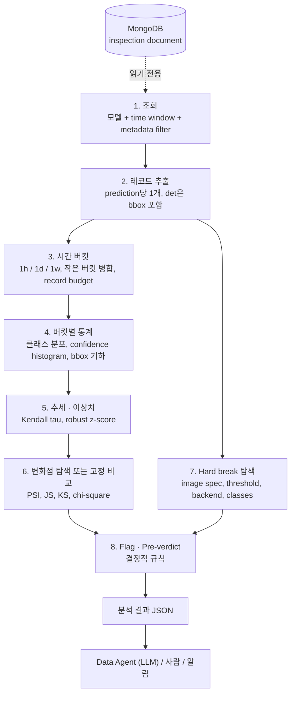
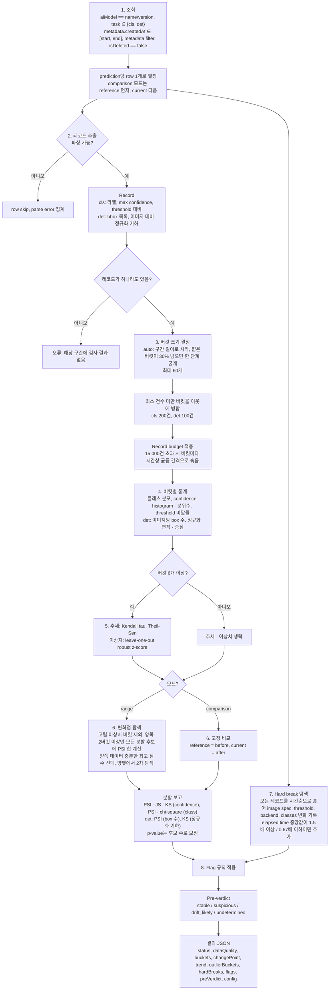

> **구버전 안내.** 이 문서는 원본 inspection document를 직접 읽던 이전 구현을 설명합니다. 현재 tool은 사전 집계된
> `inspectionStatistics` collection을 읽습니다. [DATA_DRIFT.md](../DATA_DRIFT.md)와
> [inspection_statistics.md](inspection_statistics.md)를 참고하세요. 목적, drift 종류, PSI 해석 기준은 그대로
> 유효하지만 bucket, KS test, trend, outlier, box geometry, image spec break는 더 이상 존재하지 않습니다.

# [데이터 서비스] 데이터 드리프트 분석 — 동작 원리

**English version:** [data_drift.en.md](data_drift.en.md)

---

## 1. 목적

- 배포된 검사 모델의 입력 데이터 또는 동작이 변했는지 판단하는 데 필요한 통계를 계산한다.
  - 카메라 이동, 조명 변화, 신규 공급사 부품, 렌즈 오염 등이 원인이 된다.
  - 모델은 계속 판정을 내리지만 추론 시점에는 정답이 없어 아무도 알아채지 못한다.
- 데이터베이스에는 이미지도 정답 라벨도 없다.
  - 대신 모델이 출력한 모든 것이 있다: 예측 클래스, confidence, bbox, 적용된 threshold.
  - 따라서 모델 출력의 분포를 시간에 따라 관찰한다.
- 도구는 스스로 결론을 내리지 않는다.
  - 결정적 규칙으로 flag와 pre-verdict를 만든다.
  - LLM 또는 사람이 숫자를 읽고 확정하거나 뒤집는다.
- Data Agent가 호출하는 MongoDB MCP 도구 중 하나이다.
  - Inspection Summarizer, Feature Vector 추출 파이프라인과 같은 inspection collection을 읽는다.
  - 읽기만 하며 아무것도 쓰지 않는다.

### 1.1 구분하는 드리프트 종류

| 종류 | 의미 | 출력에 남는 흔적 |
|---|---|---|
| Covariate shift | 이미지가 바뀌었고 라벨의 의미는 그대로 | Confidence histogram이 낮은 구간으로 이동, threshold 미달률 상승, 클래스 분포는 거의 유지 |
| Prior / label shift | 클래스 비율이 바뀜 | 클래스 분포 이동, confidence histogram은 유지 |
| Configuration change | 카메라, threshold, runtime, 클래스 목록이 바뀜 | Hard break, 보통 위 둘 중 하나가 뒤따름 |

- Classification(`cls`)과 detection(`det`) 모델만 지원한다.
  - Segmentation 출력은 mask 파일이라 비교할 것이 없다.

---

## 2. 전체 구조

### 2.1 구조도



### 2.2 컴포넌트별 역할

| 컴포넌트 | 역할 | 접근 |
|---|---|---|
| MongoDB (inspection collection) | 모델이 무엇을, 얼마나 확신하며, 어떤 설정으로 판정했는지의 원본 | 읽기 전용 |
| Drift 분석 도구 | 조회, 레코드 추출, 버킷화, 통계, 변화점, flag, pre-verdict를 한 번의 호출로 수행 | MCP 도구, 요청당 1회 |
| Data Agent (LLM) | 사용자 질문에서 인자를 채우고 결과 JSON을 읽어 해석 | MCP client |
| 설정값 | 모든 임계값과 최소 조건, 결과에 그대로 echo됨 | 코드 변경 없이 조정 |

---

## 3. 입력: Inspection Document

- 아래에 표시된 부분만 사용한다.

```
{
  "_id": ...,
  "metadata": {
    "gbm": "SEHC", "process": "Side", "location": "Line_01",
    "equipmentId": "SEHC_Side_VM07", "productId": "...",
    "createdAt": ISODate("2026-09-08T08:12:31Z"), "mode": "production"
  },
  "dataSpec": [ { "width": 1920, "height": 1080, "channels": 3 } ],   // 이미지 크기, fileIndex로 참조
  "inspectionResult": {
    "aiResults": [
      {
        "aiModel": "MetalDet/1.0",                                     // modelName/modelVersion
        "task": "det",                                                 // cls | det | seg
        "backend": "onnxruntime",                                      // runtime
        "classes": ["Good", "NG", "Scratch"],                          // 모델의 출력 클래스 목록
        "predictions": [
          { "predictionId": 0, "fileIndex": 0,
            "threshold": 0.5, "elapsedTime": 0.61,
            "prediction": "NG", "confidence": [0.03, 0.97],            // cls: float 또는 float list
            "detections": [                                            // det만
              { "prediction": "NG", "confidence": 0.90, "threshold": 0.5, "bbox": [412, 88, 530, 197] }
            ] }
        ]
      }
    ]
  },
  "isDeleted": false
}
```

| 항목 | 의미 |
|---|---|
| `metadata.*` | 검사가 이루어진 장소와 시각, 조회 filter 및 hard break 추적에 사용 |
| `dataSpec[]` | 이미지 크기, bbox 정규화와 `image_spec` hard break에 사용 |
| `aiResults[]` | 이 검사에서 실행된 모델당 하나 |
| `aiModel`, `task` | 분석 대상 모델을 `name/version`으로 정확히 매칭, task는 `cls` 또는 `det` |
| `backend`, `classes` | Runtime과 출력 클래스 목록, 바뀌면 hard break |
| `predictions[]` | 검사된 이미지당 하나, 레코드 1개가 됨 |
| `prediction`, `confidence`, `threshold` | 모델의 라벨, 점수, 적용된 threshold |
| `elapsedTime` | 추론 시간, 인프라 변화 감지에 사용 |
| `detections[]` (det만) | 검출된 객체당 하나, 각각 라벨, confidence, threshold, `bbox`를 가짐 |

- `decision`과 `feedbacks`는 읽지 않는다.
  - 입력 분포에 대한 정보가 없다.

---

## 4. 두 가지 분석 모드

| 모드 | 조건 | 하는 일 |
|---|---|---|
| Range (기본) | `start_date` ~ `end_date`만 지정 | 구간을 버킷으로 나누고 분포가 가장 크게 바뀐 시점(변화점), 점진적 추세, 이상치 버킷을 찾음 |
| Comparison | `reference_start_date` ~ `reference_end_date`를 추가 지정 | 변화점을 찾지 않고 reference 구간과 current 구간을 고정된 경계에서 비교 |

- 두 구간을 합쳐 최대 30일까지 분석한다.
- Reference 구간은 current 구간이 시작하기 전에 끝나야 한다.
- 모든 날짜는 UTC이며 양 끝을 포함한다.
- 양산일이 드문 경우 range 모드는 버킷이 부족해질 수 있다.
  - 이때는 과거 reference 구간과의 comparison 모드가 결론을 낼 수 있다.

---

## 5. 처리 흐름

### 5.1 전체 흐름



### 5.2 조회 (1단계)

| Filter | 필드 | 비고 |
|---|---|---|
| 모델 (필수) | `aiResults.aiModel` | `model_name/model_version`으로 정확히 일치 |
| task | `aiResults.task` | 생략 시 `cls`, `det` 모두 허용, 첫 row의 task가 분석 task가 됨 |
| time window (필수) | `metadata.createdAt` | 폐구간 `[start, end]`, UTC |
| gbm, process, location, equipment id | `metadata.*` | 정확히 일치, 하나씩만 |
| mode | `metadata.mode` | 기본 `production`, `null`을 주면 모든 mode 포함 |
| deleted | `isDeleted` | 항상 제외 |

- 문서 하나가 aiResult 하나, prediction 하나당 row 1개로 펼쳐진다.
  - 검출 결과는 이미지 row 안에 함께 온다.
- Row는 스트리밍으로 읽고 추출된 레코드만 메모리에 남긴다.
- 한 모델이 여러 카메라에서 돌면 `equipment_id`를 반드시 지정한다.
  - 이미지 크기가 다른 두 카메라가 섞이면 카메라가 계속 바뀌는 것처럼 보인다.

### 5.3 레코드 추출 (2단계)

- Prediction 1개가 레코드 1개가 된다.
  - 같은 문서, 같은 aiResult, 같은 predictionId는 한 번만 센다.
  - 파싱에 실패한 row는 skip하고 집계하며, 절대 run을 멈추지 않는다.
- Confidence가 float list이면 최댓값으로 줄인다.
  - 없거나 숫자가 아니면 null로 두고 집계한다.
  - 레코드는 유지되며 confidence 통계에만 빠진다.
- Classification 레코드는 threshold 대비 위치를 함께 계산한다.
  - `below_threshold`: confidence가 threshold 미만.
  - `near_threshold`: confidence와 threshold의 차이가 0.05 미만.
- Detection 레코드는 bbox마다 라벨, confidence, threshold, 기하를 가진다.
  - 기하는 이미지 크기로 나눈 정규화 값도 함께 가진다.
  - 카메라 해상도가 바뀌어도 box 크기가 바뀐 것처럼 보이지 않게 하기 위함이다.
  - 이미지 크기를 모르면 정규화 값은 null이고 집계된다.
- Hard break 추적을 위해 image spec, backend, classes, threshold도 레코드에 남긴다.

### 5.4 시간 버킷 (3단계)

- 통계는 버킷 단위로 계산하여 "언제" 바뀌었는지 보이게 한다.
  - 버킷은 UTC 경계로 자른다: 정시(`1h`), 자정(`1d`), 월요일 자정(`1w`).
  - 레코드가 있는 구간에만 버킷이 생긴다.
- 버킷 하나는 최소 건수 이상이어야 한다.
  - cls 200건, det 100건.
  - 30건짜리 버킷의 클래스 비율 차이는 드리프트가 아니라 표본 잡음이다.
- `auto` 크기 선택은 추측 후 검증이다.
  - 총 기간이 2일 이하이면 `1h`, 그 외에는 `1d`로 시작한다.
  - 얇은 버킷이 전체의 30%를 넘으면 한 단계 굵게 간다.
  - 버킷이 60개를 넘으면 한 단계 더 굵게 간다.
- 얇은 버킷은 다음 버킷에 앞으로 병합한다.
  - 마지막 버킷만 이전 버킷에 뒤로 병합한다.
  - 병합은 구간별로 이루어져 reference와 current 경계를 넘지 않는다.
  - 병합된 버킷의 기간은 흡수한 버킷 사이의 빈 날도 포함한다.
- Record budget으로 분석 건수를 제한한다.
  - 두 구간 합쳐 15,000건을 넘으면 버킷마다 비율대로, 시간상 균등 간격으로 솎는다.
  - 무작위가 아니므로 같은 요청은 항상 같은 결과를 낸다.
  - 버킷은 최소 건수 아래로 내려가지 않는다.
  - Hard break는 솎기 전의 모든 레코드에서 찾는다.

### 5.5 버킷별 통계 (4단계)

- 모든 버킷은 같은 통계를 가진다.

| 통계 | 내용 |
|---|---|
| 클래스 분포 | 모든 클래스의 비율, 없는 클래스는 0.0 |
| Confidence | 중앙값, 평균, 표준편차, 고정 구간 histogram, 분위수 |
| Threshold | 미달률, 근접률(cls만), 관측된 threshold 값 목록 |
| 이미지 | 관측된 이미지 크기 목록, 추론 시간 중앙값 |
| Box (det만) | 이미지당 box 수 평균 · 표준편차 · histogram, box 없는 이미지 비율, 클래스별 box 수, 정규화 기하 분위수 |

- Detection은 confidence, 클래스, threshold 통계를 이미지가 아닌 box 단위로 계산한다.
- Histogram 구간은 항상 고정이다.
  - Confidence는 `[0, 0.1) … [0.9, 1.0]`의 10개 구간.
  - 구간이 같아야 지난주 버킷과 오늘 버킷을 비교할 수 있다.
- 내부적으로는 비율이 아닌 개수를 보관한다.
  - 개수는 더할 수 있으므로 연속된 버킷 묶음의 histogram이 정확히 나온다.
  - 변화점 탐색이 싸고 정확해지는 이유다.

### 5.6 추세와 이상치 (5단계)

- 버킷이 6개 이상일 때만 실행한다.
- 추세는 스칼라 시계열마다 계산한다.
  - 대상: confidence 중앙값 · 평균, threshold 미달률, 이미지당 box 수, box 없는 비율, 정규화 면적 · 중심, 클래스별 비율.
  - Kendall tau와 p-value로 단조성을, Theil-Sen 기울기로 버킷당 변화량을 잰다.
  - 순위 기반이라 나쁜 버킷 하나나 불균등한 간격에 강하다.
- 추세는 유의하면서 실질적으로 클 때만 `meaningful`이다.
  - 값 계열은 절대 변화 0.03 이상.
  - 비율 계열은 절대 0.02 이상 또는 상대 50% 이상.
  - 개수 계열은 상대 20% 이상.
  - 건수가 많으면 0.005의 하락도 통계적으로는 확실하지만 운영상 무의미하다.
- 이상치는 버킷마다 나머지 버킷 대비 robust z-score로 판정한다.
  - 중앙값과 MAD를 쓰므로 이상치 자신에게 끌려가지 않는다.
  - `|z| > 3.5`이면서 실질적으로 큰 변화일 때만 이상치다.

### 5.7 변화점과 비교 (6단계)

- 변화점은 "구간을 앞뒤로 자를 때 두 쪽이 가장 다른 지점"이다.
- Range 모드는 먼저 고립된 이상치 버킷을 탐색에서 뺀다.
  - 이웃이 정상인 이상치 하나는 하루짜리 사건이지 지속적 변화가 아니다.
  - 연속된 두 개 이상의 이상치는 수준 변화이므로 남긴다.
- 양쪽에 2버킷 이상 남는 모든 분할 위치에 점수를 매긴다.
  - 점수 = confidence histogram PSI + 클래스 분포 PSI + (det) 이미지당 box 수 PSI.
  - 세 종류의 변화 중 어느 것이 가장 크든 찾아내기 위해 합산한다.
- 양쪽 데이터가 충분한 분할 중 최고 점수를 고른다.
  - 충분: 양쪽 각각 cls 500건, det 300장 및 box 300개.
  - 충분한 분할이 없으면 최고 점수 분할을 `sidesSufficient = false`로 보고만 한다.
  - 이때 shift flag는 켜지지 않고 `INSUFFICIENT_DATA`가 켜진다.
- 선택된 분할에 대해 전체 비교를 계산한다.

| 측정 | 대상 | 의미 |
|---|---|---|
| PSI | confidence histogram, 클래스 분포, (det) box 수 histogram | 분포가 얼마나 움직였는가, `< 0.10` 없음, `0.10 ~ 0.25` 보통, `> 0.25` 큼 |
| Jensen-Shannon | confidence histogram | PSI의 두 번째 의견, `[0, 1]`로 유계 |
| KS | 원본 confidence, (det) 정규화 면적 · 중심 x · 중심 y | 구간 없이 연속값을 비교, `d`로 판단 |
| Chi-square | 클래스 개수 표 | 클래스 분포 차이의 유의성, 최대 비율 변화와 함께 읽음 |

- 탐색으로 고른 분할의 p-value는 후보 수만큼 보정한다.
  - 최댓값을 고른 자리의 p-value는 원래보다 작게 나오기 때문이다.
- 1차 분할의 양옆에서 같은 탐색을 한 번씩 더 한다.
  - 데이터가 충분한 경우에만 2차 변화점으로 보고한다.
- Comparison 모드는 탐색을 건너뛴다.
  - Reference가 before, current가 after이며 후보 수는 1이다.
  - 추세와 이상치는 두 구간을 이어 붙인 시계열에서 그대로 계산한다.
- 어느 두 버킷 사이의 PSI 최댓값도 따로 보고한다.
  - 앞뒤로 나누면 상쇄되는 짧은 사건 두 개도 드러난다.

### 5.8 Hard break (7단계)

- 조용히 바뀌어서는 안 되는 값을 시간순으로 비교한다.

| 종류 | 의미 |
|---|---|
| `image_spec` | 카메라 또는 전처리가 바뀜 |
| `threshold` | 모델 설정이 바뀜, det은 클래스별로 추적 |
| `backend` | Runtime이 바뀜 |
| `classes` | 출력 공간이 바뀜 |
| `elapsed_time` | 분할 전후 추론 시간 중앙값이 1.5배 이상 또는 0.67배 이하, 인프라 변화 |

- Hard break는 통계가 아니라 설정 사건이다.
  - 보통 그 뒤에 바뀐 모든 것을 설명한다.
  - 그래서 hard break 하나만으로 pre-verdict가 `drift_likely`가 된다.

### 5.9 예시

- Classification 모델, 2026-09-01 ~ 2026-09-14, 일 버킷 14개.

| 버킷 | 건수 | Confidence 중앙값 | Threshold 미달률 | NG 비율 |
|---|---|---|---|---|
| 09-01 ~ 09-07 | 약 1,000/일 | 0.94 | 0.03 | 0.12 |
| 09-08 ~ 09-14 | 약 1,000/일 | 0.89 | 0.07 | 0.13 |

- 결과:
  - 변화점 `date = 2026-09-08`, confidence PSI **0.48**, 클래스 PSI 0.01.
  - Flag: `CONFIDENCE_SHIFT`, `THRESHOLD_PRESSURE`, `TREND_MEDIAN_CONFIDENCE`, `TREND_BELOW_THRESHOLD_RATE`.
  - Pre-verdict: `drift_likely`.
- 해석: 클래스 비율은 그대로인데 confidence만 내려갔다.
  - 이미지가 바뀐 covariate shift이며 조명 또는 카메라 오염이 가장 유력하다.
  - 추세 flag 두 개는 같은 confidence 계열이므로 하나의 신호로 센다.

---

## 6. 판정 규칙: Flag와 Pre-verdict

### 6.1 Flag

| Flag | 조건 |
|---|---|
| `INSUFFICIENT_DATA` | Current 구간 건수가 최소 미만, 또는 1차 분할 · 비교의 양쪽이 불충분 |
| `INSUFFICIENT_BUCKETS` | 병합 후 버킷이 4개 미만, 또는 분할을 탐색할 수 없음 (range만) |
| `HARD_BREAK` | `elapsed_time` 이외의 hard break가 있음 |
| `CONFIDENCE_SHIFT` | Confidence PSI `>= 0.25` |
| `CONFIDENCE_SHIFT_MODERATE` | Confidence PSI `0.10 ~ 0.25` |
| `CLASS_SHIFT` | 클래스 PSI `>= 0.25`, 또는 chi-square `p < 0.001`이면서 최대 비율 변화 `>= 0.05` |
| `CLASS_SHIFT_MODERATE` | 클래스 PSI `0.10 ~ 0.25` |
| `BOX_COUNT_SHIFT` | det: 이미지당 box 수 PSI `>= 0.25` |
| `BOX_GEOMETRY_SHIFT` | det: 정규화 기하 KS 중 하나가 `d >= 0.15`이면서 `p < 0.01` |
| `THRESHOLD_PRESSURE` | 미달률이 before의 2배 이상이면서 0.02 이상 증가 |
| `TREND_<SERIES>` | 유의미한 추세 계열마다 하나, 클래스 비율 추세는 `TREND_CLASS_SHARE` 하나로 합침 |
| `TRANSIENT_OUTLIER` | 이상치 버킷은 있으나 shift flag도 trend flag도 없음 |

- 분할 기반 flag는 양쪽 데이터가 충분할 때만 켜진다.
  - 80건으로 계산한 PSI를 8,000건의 것처럼 보고하면 독자를 속이게 된다.

### 6.2 Pre-verdict

```
undetermined  INSUFFICIENT_* flag가 하나라도 있음
drift_likely  HARD_BREAK, CONFIDENCE_SHIFT, CLASS_SHIFT, BOX_COUNT_SHIFT, BOX_GEOMETRY_SHIFT 중 하나,
              또는 두 계열 이상의 TREND_* flag
suspicious    *_MODERATE, THRESHOLD_PRESSURE, TRANSIENT_OUTLIER, 또는 한 계열의 TREND_* flag만 있음
stable        그 외
```

- 추세는 계열 단위로 센다.
  - 계열: confidence (중앙값, 평균, 미달률), 클래스 비율, box 수 (평균, 없는 비율), box 기하 (면적, 중심 x · y).
  - Confidence 중앙값 · 평균 · 미달률은 같은 하락의 세 가지 시점이라 하나로 센다.
- 검증하지 못한 데이터에는 절대 `stable`을 주지 않는다.
  - 부족하면 `undetermined`다.

---

## 7. 출력: 분석 결과

- 결과는 JSON 하나이며 모든 float은 소수 4자리로 반올림된다.
- `status`를 먼저 읽는다.
  - `analysisPossible`이 false이면 나머지는 설명용이다.

| 그룹 | 필드 | 답하는 질문 |
|---|---|---|
| 요청 echo | `modelName`, `modelVersion`, `task`, `mode`, `filters`, `range`, `referenceRange`, `bucket`, `detail` | 무엇을 어떤 조건으로 분석했나 |
| `status` | `analysisPossible`, `changePointRan`, `comparisonRan`, `trendRan`, `outlierRan`, `bucketCount` | 무엇을 계산할 수 있었나 |
| `dataQuality` | 조회 · 매칭 · 추출 건수, `analyzedRecordCount`, `samplingRatio`, 누락 · 파싱 오류 건수, `mergedBuckets` | 숫자가 얼마나 많은 데이터 위에 서 있나 |
| `classes` | 모델이 출력한 모든 클래스 | 어떤 클래스가 있나 |
| `buckets` | 버킷별 시계열 통계, `detail = compact`면 스칼라만 | 언제 움직였나, 각 버킷은 믿을 만한가 |
| `changePoint` / `comparison` | 분할 시점, 양쪽 건수와 충분 여부, PSI · JS · KS · chi-square, before · after 요약 | 언제, 얼마나, 어느 방향으로 |
| `secondaryChangePoints` | 1차 분할 양옆의 추가 분할 | 두 번째 사건이 있나 |
| `maxPairwise` | 가장 다른 두 버킷과 그 PSI | 앞뒤로 나누면 안 보이는 최악의 차이 |
| `trend` | 계열별 tau, p, 기울기, 처음 · 마지막 값, `meaningful` | 점진적으로 변하고 있나 |
| `outlierBuckets` | 버킷, 계열, z, 값 | 튀는 날이 있나 |
| `hardBreaks` | 종류, 클래스, 시각, 문서 id, 이전 · 이후 값 | 설정이 바뀌었나 |
| `flags`, `preVerdict` | 켜진 규칙과 결정적 결론 | 첫 번째 판단 |
| `config` | 사용된 모든 임계값 | 재현 가능한가 |

- `detail = compact`는 buckets에서 histogram과 분위수를 뺀다.
  - Flag는 스칼라 계열만 읽으므로 두 형태에서 동일하다.
  - 결과 크기는 구간, task, detail에 따라 10 ~ 75 KB다.

---

## 8. 결과 해석

### 8.1 흔적과 가장 유력한 원인

| 관찰 | 가장 유력한 설명 |
|---|---|
| Confidence histogram이 낮은 구간으로 이동, 미달률 · 근접률 상승, 클래스 분포는 거의 유지 | Covariate shift, 이미지가 바뀌어 모델이 덜 확신함, 가장 이르고 믿을 만한 흔적 |
| 클래스 분포는 크게 바뀌고 confidence histogram은 유지 | Prior / label shift, 제품 mix 또는 불량률이 실제로 바뀜, 모델은 정상일 수 있음 |
| Confidence와 클래스 분포가 함께 이동 | 실제 드리프트 또는 새로운 불량 유형 |
| 정규화 면적 · 중심의 KS가 큼 | 카메라 이동, zoom 변경, 지그 또는 부품 변경, 거의 항상 물리적 원인 |
| 이미지당 box 수 histogram 또는 box 없는 비율 이동 | 검출기가 객체를 놓치거나 (조명, 오염) 없는 객체를 봄 (이물, 신규 부품) |
| Hard break 있음 | 설정 변경, 라인 담당자에게 먼저 확인 |
| 이상치 버킷 하나, shift flag와 trend flag 없음 | 일시적 사건 (불량 lot, 조명 꺼진 교대), 드리프트 아님 |
| 유의미한 추세, shift flag 없음 | 점진적 열화 (렌즈 오염, 마모, 느린 공정 변화) |
| `elapsed_time`과 `image_spec` hard break 동시 | 해상도 또는 전처리 변경, 데이터가 아닌 인프라 |
| 긴 구간인데 `INSUFFICIENT_BUCKETS` | 양산일이 적음, comparison 모드를 권장 |

- 변화점은 "언제", PSI와 KS는 "얼마나", before · after histogram은 "어느 방향으로"를 답한다.
- 계단식 변화는 단조이므로 shift flag와 trend flag를 함께 만든다.
  - 독립된 두 신호로 세지 않는다.

### 8.2 주의 규칙

- `sidesSufficient`가 false인 비교는 믿지 않는다.
- 유의하지만 작은 효과는 무시한다.
  - KS `d < 0.05`, PSI `< 0.10`.
  - 표본이 수천 개면 `d = 0.03`도 p-value가 매우 작지만 아무 의미 없다.
- 고립된 이상치 버킷은 변화점이나 추세가 뒷받침하지 않는 한 일시적 사건이다.
- Hard break는 설정 사건이 먼저이고 드리프트는 그 다음이다.
- 숫자를 지어내지 않고 JSON의 값과 버킷 날짜를 인용한다.
- Pre-verdict와 다르게 판단하면 그 근거 숫자를 명시한다.

### 8.3 LLM과 함께

- Data Agent가 사용자 질문에서 인자를 채우고 결과 JSON을 받아 해석한다.
  - LLM은 아무것도 계산하지 않는다.
- 시계열과 변화점만 필요하면 `detail = compact`를 쓴다.
  - 버킷별 histogram 모양을 추론해야 하면 `full`을 쓴다.
- 해석 지침은 소비하는 agent의 system prompt에 둔다.
  - 역할: pre-verdict를 확정하거나 뒤집고 이유를 설명한다.
  - 고정된 JSON 구조로 답한다: 드리프트 여부, 확신도, 종류, 시작일, 신호, 유력 원인, 권장 조치, pre-verdict 동의 여부.

### 8.4 LLM 없이

- `preVerdict`, `flags`, `changePoint.date`만으로 자동 알림이 가능하다.

| Pre-verdict | 권장 정책 |
|---|---|
| `drift_likely` | 알림 |
| `suspicious` | 기록 |
| `stable` | 무시 |
| `undetermined` | 모델 문제가 아닌 데이터 가용성 문제로 취급 |

- `hardBreaks`는 verdict와 무관하게 라인 담당자에게 별도 통보한다.

---

## 9. 호출 방법

- MCP 도구이므로 Data Agent가 자연어 질문을 인자로 바꿔 호출한다.

**인자**

| 인자 | 의미 |
|---|---|
| `model_name`, `model_version` | 필수, `name/version`으로 정확히 일치 |
| `start_date`, `end_date` | 필수, current 구간, UTC, 양 끝 포함 |
| `task` | `cls` 또는 `det`, 같은 모델 문자열이 두 task에 쓰일 때만 필요 |
| `gbm`, `process`, `location`, `equipment_id` | Metadata filter, 정확히 일치 |
| `mode` | 기본 `production`, `null`이면 모든 mode |
| `bucket` | `auto` (기본), `1h`, `1d`, `1w` |
| `detail` | `full` (기본) 또는 `compact` |
| `reference_start_date`, `reference_end_date` | 둘 다 주면 comparison 모드 |

**대표 사용 예**

```
# 최근 2주 range 분석
model_name=MetalDet, model_version=1.0, start_date=2026-09-01, end_date=2026-09-14, gbm=SEHC, equipment_id=SEHC_Side_VM07

# 지난달 대비 이번 주 comparison 분석, 시계열만
model_name=MetalDet, model_version=1.0, start_date=2026-09-08, end_date=2026-09-14,
reference_start_date=2026-08-11, reference_end_date=2026-08-24, detail=compact

# 시간 단위로 하루 들여다보기
model_name=sidebottom, model_version=250429_260113072605, task=cls, start_date=2026-09-08, end_date=2026-09-09, bucket=1h
```

- 모든 임계값과 최소 조건은 설정값 하나에 모여 있다.
  - 구간 · 버킷 한도, record budget, 최소 건수, PSI · KS · chi-square 임계값, 추세 · 이상치 임계값.
  - 코드 변경 없이 조정할 수 있고 결과의 `config`에 그대로 echo된다.

---

## 10. 제약사항 및 참고

- **구간 길이** — 두 구간 합쳐 최대 30일이다.
  - 주 버킷은 사실상 쓰이지 않고 `auto`는 시간 또는 일 버킷으로 시작한다.
- **여러 카메라** — hard break는 장비와 무관하게 연속 레코드를 비교한다.
  - 한 모델이 여러 카메라에서 돌면 `equipment_id`를 지정해야 한다.
- **낮은 기준 비율** — 추세 · 이상치의 실질 변화 임계값은 표본 크기에 따라 조정되지 않는다.
  - 미달률 2% 수준에서는 표본 잡음이 `TRANSIENT_OUTLIER`와 `suspicious`를 만들 수 있다.
  - 실제 드리프트를 숨기지는 않는다.
- **자동 버킷 크기** — 얇은 버킷의 개수를 세지 건수를 세지 않는다.
  - 거의 빈 날 몇 개가 필요 이상으로 굵은 버킷을 고르게 할 수 있다.
- **병합된 버킷** — 기간이 흡수된 버킷 사이의 빈 날을 숨긴다.
  - `mergedFrom`이 유일한 단서다.
- **Record budget** — 초과 시 버킷 통계는 솎은 레코드를 설명한다.
  - `samplingRatio`가 1.0 미만이면 그렇다.
  - 0으로 두면 전부 분석하지만 호출이 길어져 client timeout에 걸릴 수 있다.
- **Task 미지정** — 같은 모델 문자열이 두 task에 쓰이면 첫 row의 task를 쓰고 나머지는 무시한다.
  - `task`를 명시할 것.
- **Segmentation** — 처리하지 않는다.
- **결론** — 도구의 pre-verdict는 출발점이다.
  - 최종 판단은 숫자를 읽는 LLM 또는 사람이 한다.
